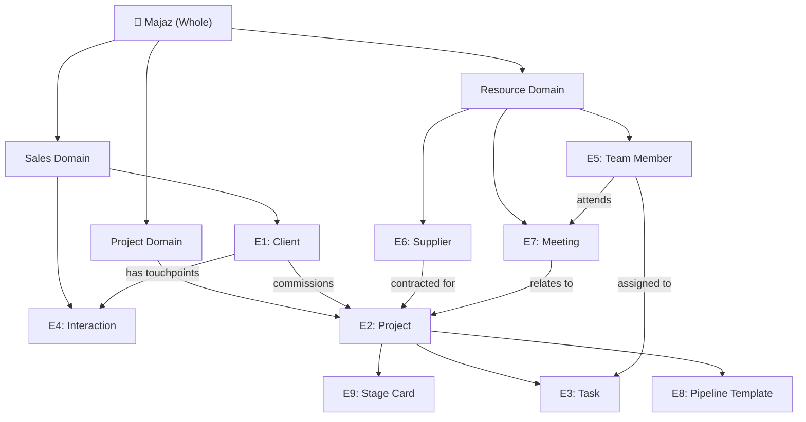

# Notion CRM Optimization Plan v3.0 — Majaz Engineering Consultancy

> **Date:** 2026-03-25 | **Auditor:** Daedalus  
> **Scope:** Ontological analysis, structural fixes, data enrichment, views, delegation, unknown unknowns  
> **SSoT References:** [company_context.md](file:///D:/YO/WS/context/company_context.md), [strategy.md](file:///D:/YO/WS/context/strategy.md), [icp.md](file:///D:/YO/WS/context/icp.md), [heuristics.md](file:///D:/YO/WS/context/heuristics.md), [notion_deep_audit_2026.md](file:///D:/YO/WS/context/audit/notion_deep_audit_2026.md)

---

## §0 Ontological & Mereological Taxonomy

### 0.1 Domain Ontology — What Majaz IS

Majaz is a **boutique architecture & engineering (A&E) consultancy** operating in the UAE. Its ontological identity determines what the CRM must model.

```
                    ┌──────────────────────────────────┐
                    │     MAJAZ ENGINEERING (Firm)      │
                    │  Type: Boutique A&E Consultancy   │
                    │  Market: B2C (HNW Individuals)    │
                    │  Geography: Abu Dhabi + Dubai      │
                    └──────────────┬───────────────────┘
                                  │
        ┌─────────────────────────┼──────────────────────────┐
        │                         │                          │
   SALES DOMAIN              PROJECT DOMAIN          RESOURCE DOMAIN
   (Lead → Client)         (Brief → Handover)       (People, Suppliers)
   ┌──────────────┐       ┌──────────────────┐     ┌─────────────────┐
   │ Landlord/Lead│       │ Project          │     │ Team Member     │
   │ Interaction  │       │ Task             │     │ Supplier        │
   │ Pipeline     │       │ Stage Task Card  │     │ Meeting         │
   └──────────────┘       │ Work Pipeline    │     └─────────────────┘
                          │ Concept Plans    │
                          └──────────────────┘
```

### 0.2 Entity Classification (9 Classes)

| # | Entity | Ontological Role | Notion DB | Cardinality |
|---|--------|-----------------|-----------|-------------|
| E1 | **Client (Landlord)** | *Person* — the buyer, the one who commissions and pays | LIST OF LANDLORDS | ~46 records |
| E2 | **Project** | *Endeavor* — a bounded scope of work with phases, budget, and deliverables | PROJECTS | ~47 records |
| E3 | **Task** | *Activity* — atomic unit of work within a project phase | TASKS | ~60+ records |
| E4 | **Interaction** | *Event* — a point-in-time communication touchpoint | INTERACTIONS | ~2 records ⚠️ |
| E5 | **Team Member** | *Agent* — a person who performs work | TEAM MEMBERS | ~6 records |
| E6 | **Supplier** | *Agent* — an external entity providing materials or services | Suppliers | ~10 records |
| E7 | **Meeting** | *Event* — a scheduled multi-party gathering | Meetings | ~5 records |
| E8 | **Work Pipeline** | *Template* — a reusable workflow sequence for a project phase | Work Pipeline | ~50 records |
| E9 | **Stage Task Card** | *Template/Tracker* — per-stage checklist linking tasks to projects | Stage Task Card | ~20 records |

### 0.3 Mereological Decomposition (Part-Whole)

Every entity participates in one or more part-whole relationships. The CRM must faithfully model these.



**Mereological Rules:**
1. A **Client** is the *whole* that owns ≥1 **Projects** (parts)
2. A **Project** is the *whole* that decomposes into **Tasks** (parts)
3. A **Project** traverses a **Pipeline** (template sequence: SD → DD → CD → AS → Bidding → Progress → Handing Over)
4. A **Task** is *assigned to* a **Team Member** (agent)
5. An **Interaction** is a *part of* a **Client's** communication history
6. A **Meeting** is a *cross-cutting event* involving **Projects** + **Team Members** + (optionally) **Clients**
7. A **Supplier** is an external *agent* contracted *per-Project*

### 0.4 Ontological Contradictions Found

| # | Contradiction | Where | Severity | Resolution |
|---|--------------|-------|:---:|-----------|
| OC-1 | **"Landlord" ≠ "Client"** — Notion uses "LIST OF LANDLORDS" but Majaz serves landowners, investors, and families. Not all are landlords. | DB name | 🟡 | Rename concept to "CLIENTS" in all documentation. Notion DB name is cosmetic — keep for stability but document alias. |
| OC-2 | **Project ↔ Client is many-to-many** but modeled as many-to-one — a client can have multiple projects (✅ correct), but a project can also have **multiple clients** (co-owners, investors). Currently single-relation. | PROJECTS → LIST OF LANDLORDS | 🟡 | Document as known limitation. Workaround: use `Projects of Clients` (dual) for primary + `LIST OF LANDLORDS` (single) for secondary. |
| OC-3 | **"Work Pipeline" is both template AND tracker** — the same DB holds reusable workflow steps AND project-specific tracking (checkboxes). Conflates type with instance. | Work Pipeline | 🔴 | The admin should clarify: Is it one pipeline per project (instance), or a master template copied per project? If template → it should be read-only. If tracker → it needs a Project relation per row. Currently has `PROJECTS` relation, suggesting it's a tracker. |
| OC-4 | **"Stage Task Card" duplicates "Tasks"** — both track work items with Status, Assignment, and Due Date. Unclear which is authoritative. | Stage Task Card vs TASKS | 🔴 | Stage Task Card appears to be a *per-stage grouping* of tasks (a view layer), not an independent entity. It should either: (a) be merged into TASKS with a Stage filter, or (b) documented as a project-stage-level tracker distinct from individual tasks. |
| OC-5 | **Dual databases (admin/employee) create ontological ambiguity** — the same entity (Project/Task) exists in two databases. Which is the *source of truth*? | PROJECTS × 2, TASKS × 2 | 🔴 | See UU-5/UU-6 below. Must verify if they share data or are independent copies. |

### 0.5 Missing Ontological Entities

| # | Missing Entity | Domain | Why Needed | Current Workaround |
|---|---------------|--------|-----------|-------------------|
| ME-1 | **Invoice / Payment** | Sales | Cash flow tracking: milestone billing (30/30/40), overdue alerts, revenue forecasting | None — tracked via mental memory or spreadsheet |
| ME-2 | **Document / Deliverable** | Project | Track drawings, reports, NOCs per project with version control | None — `Attachments` property proposed in N2 |
| ME-3 | **Site Visit Report** | Project | Photo-documented supervision reports (2/week per heuristics §2.4) | None — exists only as WhatsApp photos |
| ME-4 | **Communication Log** | Sales | Auto-log WhatsApp/email per client (heuristics §3.2 identifies as P2 need) | INTERACTIONS db exists but has only 2 records |
| ME-5 | **Calendar / Schedule** | Resource | Unified view of meetings, site visits, deadlines, municipality dates | Meetings db has 5 records; no calendar integration |

---

## §1 Admin / Employee / Delegation Model

### 1.1 Admin Capabilities (Waseem — Principal Architect)

| # | Capability | Database(s) | Key Properties | Frequency |
|---|-----------|-------------|----------------|:---------:|
| A1 | Create & manage projects | PROJECTS (admin) | All 18 properties | Weekly |
| A2 | Create & assign tasks | TASKS (admin) | Task, Status, Assigned to, Duration | Daily |
| A3 | Manage client pipeline | LIST OF LANDLORDS | Lead Status, ICP, Budget, Due Date | Daily |
| A4 | Log interactions | INTERACTIONS | Type, Summary, Client link | 2-3x/day |
| A5 | Schedule meetings | Meetings | Name, Attendees, Projects | Weekly |
| A6 | Manage suppliers | Suppliers | Contact, Documents, Speciality | Monthly |
| A7 | Define workflows | Work Pipeline | Stage, Tasks, Duration, Checkbox | Per project |
| A8 | Manage stage checklists | Stage Task Card | Stage, Status, Due Date, Tasks link | Per stage |
| A9 | Review team info | TEAM MEMBERS | Names, Contact, DOBs | Rare |
| A10 | View KPIs & dashboard | DASHBOARD | Linked views | Daily |
| A11 | Set project financial data | PROJECTS | Value (AED), Service Type | Per project |
| A12 | Track overdue follow-ups | LIST OF LANDLORDS | Urgency, Overdue Alert, Days Since Contact | Daily |

### 1.2 Employee Capabilities (Junior Engineer / Office Admin)

| # | Capability | Database | What they CAN do | What they CANNOT do |
|---|-----------|----------|-----------------|-------------------|
| E1 | View assigned projects | PROJECTS (employee copy) | See project name, stage, description | Cannot see Value, Client link, or other projects' tasks |
| E2 | Update project stage | PROJECTS (employee) | Change Stage status | Cannot modify SN, ADM ID, or financial data |
| E3 | View assigned tasks | TASKS (employee copy) | See task name, status, due date | Cannot see other team's tasks |
| E4 | Update task status | TASKS (employee) | Change Status (7 options) | Cannot reassign or create new tasks |
| E5 | Concept plan checklists | (SD) Concept Plans | Toggle checkboxes | Cannot create new items |
| E6 | ❌ View clients | — | — | LIST OF LANDLORDS not shared |
| E7 | ❌ View interactions | — | — | INTERACTIONS not shared |
| E8 | ❌ View meetings | — | — | Meetings not shared |
| E9 | ❌ View suppliers | — | — | Suppliers not shared |
| E10 | ❌ View pipeline/workflow | — | — | Work Pipeline not shared |

### 1.3 Delegation RACI Matrix

> **R** = Responsible (does it), **A** = Accountable (approves), **C** = Consulted, **I** = Informed

| # | Action | Waseem (Admin) | Jr. Engineer | Office Admin | Notion Mechanism |
|---|--------|:---:|:---:|:---:|------------------|
| D1 | Create new project | **R/A** | I | I | Admin creates in PROJECTS; auto-appears in employee copy (if synced) |
| D2 | Update project stage | A | **R** | — | Employee updates Stage in their copy |
| D3 | Create new task | **R/A** | I | — | Admin creates + assigns via `Assigned to` |
| D4 | Update task status | A | **R** | — | Employee updates Status |
| D5 | Upload project files | A | **R** | — | Needs `Attachments` property (N2.4) |
| D6 | Add new client/lead | **R/A** | — | **R** (ICP 1-3) | Admin/Office Admin creates in LIST OF LANDLORDS |
| D7 | Log interaction | **R** | C | **R** (calls/emails) | Creates record in INTERACTIONS |
| D8 | Schedule meeting | **R/A** | I | **R** (logistics) | Creates in Meetings; attendees notified |
| D9 | Set priority | **R/A** | I | — | Admin sets `Priority` select (new property) |
| D10 | Review overdue items | **R/A** | **R** (own tasks) | — | Both check "Overdue" views |
| D11 | Manage suppliers | **R/A** | — | — | Admin only |
| D12 | Update financial data | **R/A** | — | — | Admin only (Value, Budget) |
| D13 | Run CRM health report | **R/A** | — | I | Monthly per WF-CRM-04 |

**Gap: No notification mechanism.** When admin assigns a task, employee has no alert. Must check manually.

---

## §2 Execution Phases (10)

### Phase N1 — Fix Critical Schema Bugs (👤 Manual)

> [!CAUTION]
> API cannot modify property types or status groups. Admin must fix in Notion UI.

| # | Fix | Impact |
|---|-----|:---:|
| N1.1 | Employee PROJECTS: change `ADM ID` from `number` → `rich_text` | Blocks data like `30057402/1/162230` |
| N1.2 | Employee PROJECTS: move Progress, Kickoff, Bidding from "Complete" → "In progress" group | Employees see active projects as done |
| N1.3 | Meetings: add all team member names to `Attendee` multi_select options | Only 1 person selectable |
| N1.4 | Verify: `Phone` → rename to `Phone 2` on LIST OF LANDLORDS (per heuristics §3.1) | Confusing duplicate field |
| N1.5 | Verify: `REPRESINTITAVE` → rename to `Representative` (typo fix per heuristics §3.1) | Already `Representative` in API — may be stale doc reference |

---

### Phase N2 — Add Missing Properties (🤖 API + 👤 Manual)

| # | Database | Property | Type | Per Delegation # |
|---|----------|----------|------|:-----------:|
| N2.1 | PROJECTS | `Assigned To` | people | D1 |
| N2.2 | PROJECTS | `Start Date` | date | A1 |
| N2.3 | PROJECTS | `Target Date` | date | A1 |
| N2.4 | PROJECTS | `Attachments` | files | D5 |
| N2.5 | PROJECTS | `Priority` | select (High/Medium/Low) | D9 |
| N2.6 | TASKS | `Priority` | select (High/Medium/Low) | D9 |
| N2.7 | TASKS | `Notes` | rich_text | D4 |
| N2.8 | LIST OF LANDLORDS | `Company` | rich_text | D6 |
| N2.9 | INTERACTIONS | `Follow Up Date` | date | D7 |
| N2.10 | INTERACTIONS | `Outcome` | select (Positive/Neutral/Negative) | D7 |

---

### Phase N3 — Data Enrichment: Projects (🤖 API)

| Field | Strategy | Records to Fill |
|-------|----------|:-----------:|
| Value (AED) | DESIGN: 800K–4M; SUPERVISION: 200K–1.5M | ~40 |
| Plot Info | `Plot [100-999], Sector [A-F][1-9]` | ~45 |
| FAB ID | `FAB-2026-[seq]` | ~40 |
| Description | 1-line scope per Service Type + Stage | ~20 |
| Assigned To | Distribute across team members | ~47 |
| Priority | High:20%, Medium:50%, Low:30% | ~47 |

---

### Phase N4 — Data Enrichment: Clients (🤖 API)

| Field | Strategy | Records to Fill |
|-------|----------|:-----------:|
| Budget (AED) | ICP-tier: ⭐=200K, ⭐⭐=500K, ⭐⭐⭐=1M, ⭐⭐⭐⭐=2.5M, ⭐⭐⭐⭐⭐=4.5M | ~40 |
| Last Contacted | Random 5–60 days ago | ~40 |
| Due Date | Now + 3–21 days (active leads); blank for Won/Lost | ~30 |
| Next Action | Contextual: "Send proposal" / "Follow up call" / "Schedule site visit" | ~30 |
| Referred By | Fill for Lead Source = Referral | ~15 |
| Company | Company name or "Private Client" | ~46 |

---

### Phase N5 — Enrich Interactions (🤖 API)

Generate 20 realistic interaction records:
- **Type mix:** Call(5), WhatsApp(5), Email(4), Meeting(3), Site Visit(2), Proposal Sent(1)
- **Date spread:** Last 90 days, weighted recent
- **Client coverage:** 12–15 different clients
- **Summary content:** Engineering-specific (design review, municipality update, payment discussion)

---

### Phase N6 — Fix Multi-Select & Options (🤖 API)

| Database | Property | Add Options |
|----------|----------|-------------|
| LIST OF LANDLORDS | Nation | SAUDI, JORDANIAN, SYRIAN, IRAQI, LEBANESE, OTHER |
| Suppliers | Speciality | MEP, Swimming Pool, Security Systems, Lighting, Waterproofing |
| Work Pipeline | Stage | SUPERVISION |

---

### Phase N7 — Employee Workspace Enhancement (👤 Manual Guide)

> Blueprint for admin to create in Notion UI.

**Share with employee (as linked views, read-only where needed):**
- LIST OF LANDLORDS → "Client Directory" view (Name, Phone, Location only)
- Meetings → "My Meetings" (filtered by attendee)
- Suppliers → "Contractor Directory" (read-only)

**Employee TASKS views:**

| View | Type | Filter | Purpose |
|------|------|--------|---------|
| 📋 My Tasks | Table | `Assigned to = Me` | Personal task list |
| 🗂️ Board | Board by Status | `Assigned to = Me` | Kanban of personal tasks |
| ⏰ Overdue | Table | `Deadline < Today, Status ≠ Done` | Urgency view |
| 📅 Calendar | Calendar | `Assigned to = Me` | Schedule view |

**Employee PROJECTS views:**

| View | Type | Filter | Purpose |
|------|------|--------|---------|
| 📋 My Projects | Table | Active only | Project list |
| 🗂️ By Stage | Board by Stage | — | Visual project board |

---

### Phase N8 — Admin Views Blueprint (👤 Manual Guide)

**PROJECTS (7 views):**

| View | Type | Filter/Group |
|------|------|-------------|
| 📋 Master Table | Table | SN ↑ |
| 🗂️ Stage Board | Board | by Stage |
| 📊 Active Only | Table | Stage ∉ {Done, Completed, On Hold} |
| 🏗️ Supervision | Table | Service Type = SUPERVISION |
| ✅ Archive | Table | Stage ∈ {Done, Completed} |
| 💰 Revenue | Table | Value ↓ |
| 👤 By Assignee | Board | by Assigned To (new) |

**LIST OF LANDLORDS (7 views):**

| View | Type | Filter/Group |
|------|------|-------------|
| 👥 All Clients | Table | Name ↑ |
| 🔥 Hot Leads | Table | Status ∈ {Qualified, Proposal, Negotiation} |
| 📊 Pipeline | Board | by Lead Status |
| ⚠️ Overdue | Table | Overdue Alert = "⚠️" |
| 💰 High Value | Table | ICP ≥ ⭐⭐⭐⭐ |
| 📍 By Location | Board | by Location |
| ❌ Lost Analysis | Table | Status = Lost |

**TASKS (6 views):**

| View | Type | Filter/Group |
|------|------|-------------|
| 📋 All Tasks | Table | Due Date ↑ |
| 🗂️ Status Board | Board | by Status |
| 👤 By Assignee | Board | by Assigned to |
| ⏰ Overdue | Table | Deadline < Today, ≠ Done |
| 📅 Calendar | Calendar | Due Date |
| ✅ Completed | Table | Status = Done |

**INTERACTIONS (4 views):**

| View | Type | Filter |
|------|------|--------|
| 📞 Activity Log | Table | Date ↓ |
| 📊 By Type | Board | by Type |
| 📅 Calendar | Calendar | Date |
| 📅 This Week | Table | Date = This week |

---

### Phase N9 — Rebuild DASHBOARD (🤖 API blocks + 👤 Manual linked views)

Current DASHBOARD is a placeholder (welcome header + website bookmark). Rebuild:

| Row | Block Type | Content |
|:---:|-----------|---------|
| 1 | `callout` | 🏗️ **Majaz Engineering CRM** — {date} |
| 2 | `divider` | — |
| 3 | `column_list` (3 cols) | KPI callouts: Projects / Clients / Open Tasks |
| 4 | `divider` | — |
| 5 | `heading_2` | Active Projects |
| 6 | `linked_database` | PROJECTS → "Stage Board" view |
| 7 | `heading_2` | Hot Leads |
| 8 | `linked_database` | LIST OF LANDLORDS → "Hot Leads" view |
| 9 | `heading_2` | Overdue Tasks |
| 10 | `linked_database` | TASKS → "Overdue" view |
| 11 | `heading_2` | Recent Activity |
| 12 | `linked_database` | INTERACTIONS → "This Week" view |

API builds rows 1–5, 7, 9, 11. Admin adds linked views (rows 6, 8, 10, 12).

---

### Phase N10 — Data Integrity Sweep (🤖 API)

| # | Check | Expected |
|---|-------|----------|
| 10.1 | Projects with no client link | 0 orphans |
| 10.2 | Tasks with no project link | Only admin/ops tasks |
| 10.3 | ICP-Budget alignment | ⭐⭐⭐⭐⭐ → Budget ≥ 3M |
| 10.4 | Lead status progression | No "Won" without Qualified history |
| 10.5 | Missing assignees on tasks | Flag for admin action |
| 10.6 | Stale leads | Days Since Contact > 30 for active leads |
| 10.7 | Stage coverage | All 12 stages have ≥ 1 project |
| 10.8 | Duplicate clients | Name deduplication |

---

## §3 Unknown Unknowns (15)

### Critical (🔴)

| # | Unknown | Risk | How to Verify |
|---|---------|------|--------------|
| UU-1 | **Are admin and employee DBs synced or independent?** If independent, employee data is invisible to admin. | Data loss | Update a Stage in one copy; check the other. |
| UU-2 | **When admin creates a project, does it appear in employee workspace?** | Broken delegation | Test: create a test project in admin DB; check employee DB. |
| UU-3 | **Are there Notion members beyond yamen xena?** If solo, the admin/employee split is aspirational. | Wasted architecture | Check Notion Settings → Members & guests. |
| UU-4 | **Which DB copy is the source of truth?** If employee edits admin copy directly (via search), the employee copy is dead weight. | Ontological confusion | Ask admin: "Which pages do employees bookmark daily?" |

### High (🟡)

| # | Unknown | Risk | How to Verify |
|---|---------|------|--------------|
| UU-5 | **Are there Notion automations** (buttons, recurring tasks) not visible via API? | Missing workflow logic | Admin must inventory in Notion UI → Automations tab. |
| UU-6 | **Is Work Pipeline a template or per-project tracker?** | OC-3 resolution depends on this | Query for records: if all link to single project → template. If distributed → tracker. |
| UU-7 | **Is Stage Task Card a redundant layer?** | OC-4: duplicates TASKS | Query usage: if stale, merge into TASKS views. |
| UU-8 | **Is Google Sheets still the live data source?** | Dual-entry drift | Check Google Sheet last-modified date vs Notion. |
| UU-9 | **Do (SD) Concept Plans live per-project or globally?** | Data model ambiguity | Check parent pages of existing records. |

### Medium (🟢)

| # | Unknown | Risk | How to Verify |
|---|---------|------|--------------|
| UU-10 | **How does admin get notified of status changes?** | Employee updates go unnoticed | No automations found; recommend Notion notifications setup. |
| UU-11 | **Are there views/filters already set up in Notion UI that API can't see?** | May already have some optimization | Admin must screenshot their current Notion views. |
| UU-12 | **Is the second "(SD) Concept Plans" DB a copy or linked?** | Potential stale data | Compare record counts and last-edited times. |
| UU-13 | **How does Waseem plan for municipality submission timelines?** | No calendar intersection between ADM/Dubai submissions | Ask: does he use a separate calendar? |
| UU-14 | **How does Waseem track invoicing?** | ME-1 (Invoice entity) missing | Ask: spreadsheet? Bank app? Memory? |
| UU-15 | **When Waseem hires the Junior Engineer + Office Admin, what permissions do they get?** | Current employee workspace may need restructuring | Design permissions architecture now, validate when hired. |

---

## §4 Execution Priority

| Priority | Phase | Method | Depends On | Impact |
|:---:|-------|:---:|-----------|:---:|
| 🔴 1 | **UU-1–4** Verify sync model | 👤 Admin answers | — | Blocks all other work |
| 🔴 2 | **N1** Schema fixes | 👤 Manual | — | Data corruption |
| 🟡 3 | **N2** Add properties | 🤖+👤 | N1 done | Delegation + timeline |
| 🟡 4 | **N3** Project data | 🤖 API | N2 done | Populate Analytics |
| 🟡 5 | **N4** Client data | 🤖 API | — | Formulas return values |
| 🟡 6 | **N5** Interactions | 🤖 API | — | Activity feed |
| 🟢 7 | **N6** Options fix | 🤖 API | — | Minor data quality |
| 🟢 8 | **N7** Employee views | 👤 Manual | UU-1–4 resolved |  Employee UX |
| 🟢 9 | **N8** Admin views | 👤 Manual | N3–N5 done | Analytics + operations |
| 🟢 10 | **N9** Dashboard | 🤖+👤 | N8 done | Command center |
| 🟢 11 | **N10** Integrity sweep | 🤖 API | N3–N5 done | Data quality |

---

## §5 Success Metrics

| # | Metric | Target | Current |
|---|--------|--------|:-------:|
| S1 | Database field fill rate | > 80% | ~40% |
| S2 | Views per core database | ≥ 5 | 0 |
| S3 | Orphan records | 0 | Unknown |
| S4 | Dashboard linked views | ≥ 4 | 0 |
| S5 | Interaction records | ≥ 20 | 2 |
| S6 | Employee can see: tasks, projects, schedule | ✅ | Partial |
| S7 | Admin can delegate via Notion | ✅ People + Priority | No Priority, no Assigned To on Projects |
| S8 | Unknown unknowns resolved | 15/15 | 0/15 |
